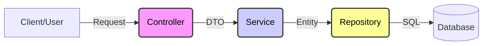

Cursor AI 에디터에서 바로 복사해서 붙여넣고 사용할 수 있도록 **Markdown(.md)** 형식으로 정리해 드립니다.

Cursor는 코드와 문서를 함께 볼 때 강력하므로, **Mermaid 다이어그램** 코드와 **Java 예제 코드**를 포함시켜 시각적으로도 완벽하게 렌더링되도록 구성했습니다.

아래 내용을 복사해서 `SpringBoot_Intro.md` 파일을 만들고 붙여넣으세요.

---

```markdown
# 🍃 Spring Boot 입문: 백엔드 개발의 시작

> **발표 주제:** Spring Boot의 핵심 개념부터 필수 어노테이션까지, 초보자를 위한 A to Z 가이드

---

## 1. Spring vs Spring Boot: 왜 Boot인가?

가장 큰 차이점은 **"개발 편의성"**입니다. 복잡한 설정을 자동화하여 비즈니스 로직에만 집중할 수 있게 해줍니다.

| 구분 | Spring (Legacy) | Spring Boot |
| :--- | :--- | :--- |
| **비유** | 🛒 **마트 장보기** (재료 하나하나 직접 구매) | 🍱 **밀키트** (손질된 재료 + 레시피 포함) |
| **설정** | 복잡한 XML 설정 필요 | `application.properties` 등으로 간편 설정 |
| **서버** | Tomcat 별도 설치 필요 | **내장 Tomcat** (실행만 하면 됨) |
| **의존성** | 라이브러리 버전 호환성 직접 체크 | `Starter`로 버전 자동 관리 |

---

## 2. Spring Boot의 3대 핵심 무기

1.  **Dependency Management (의존성 관리)**
    * `spring-boot-starter-web` 하나만 적으면 관련된 수십 개의 라이브러리(Json, Tomcat, Hibernate 등)를 알아서 가져옵니다.
2.  **Auto Configuration (자동 설정)**
    * `@EnableAutoConfiguration`을 통해 자주 사용하는 설정을 스프링이 알아서 세팅해줍니다.
3.  **Embedded WAS (내장 웹 서버)**
    * 별도의 웹 서버 설치 없이 `main()` 메서드 실행만으로 서버가 구동됩니다.

---

## 3. 계층형 아키텍처 (Layered Architecture)

Spring Boot 개발의 표준 구조입니다. **식당**에 비유하면 이해가 쉽습니다.



### 각 계층의 역할

* **🤵 Controller (웨이터):** `Presentation Layer`
* 사용자의 요청을 받고, 응답을 보냅니다. (주문 접수)
* **절대 비즈니스 로직(요리)을 직접 하지 않습니다.**


* **👨‍🍳 Service (셰프):** `Business Layer`
* 핵심 업무 로직을 수행합니다. (요리 진행, 트랜잭션 관리)


* **📦 Repository (창고지기):** `Data Access Layer`
* DB에 접근하여 데이터를 가져오거나 저장합니다. (재료 꺼내기)


---

## 4. 필수 어노테이션 (Magic Spells) ✨

이것만 알면 Spring Boot 개발을 시작할 수 있습니다.

### 🏗️ 계층 등록 (Bean Registration)

스프링에게 "이 클래스는 내가 관리할 객체야"라고 알려주는 명찰입니다.

| 어노테이션 | 설명 | 위치 |
| --- | --- | --- |
| `@RestController` | 결과물을 JSON으로 반환하는 컨트롤러 | Controller 클래스 위 |
| `@Service` | 핵심 비즈니스 로직이 있는 서비스 | Service 클래스 위 |
| `@Repository` | DB 접근을 담당하는 저장소 | Repository 인터페이스/클래스 위 |
| `@Component` | 위 3개에 해당하지 않는 일반 객체 등록 | 유틸리티 클래스 등 |

### 💉 의존성 주입 (DI)

객체를 직접 `new` 하지 않고, 스프링이 꽂아주도록 합니다.

```java
@RestController
@RequiredArgsConstructor // (추천) final 필드에 대해 생성자를 자동 생성 -> 자동 주입
public class UserController {

    private final UserService userService; // 스프링이 UserService를 여기에 꽂아줌
    
    // @Autowired (비추천) - 필드 주입 방식은 테스트가 어렵고 순환 참조 위험이 있음
}

```

### 🌐 HTTP 요청 매핑 (REST API)

* `@GetMapping("/url")`: 조회 (Read)
* `@PostMapping("/url")`: 등록 (Create)
* `@PutMapping("/url")`: 수정 (Update)
* `@DeleteMapping("/url")`: 삭제 (Delete)

---

## 5. 생산성 도구: Lombok (롬복)

지루한 반복 코드(Boilerplate code)를 어노테이션 하나로 해결합니다.

### 주요 어노테이션

* `@Getter`, `@Setter`: 게터/세터 자동 생성
* `@Builder`: 빌더 패턴 자동 생성 (객체 생성 시 가독성 UP)
* **`@NoArgsConstructor`**: **기본 생성자 생성 (JPA Entity, DTO 필수)**
* `@AllArgsConstructor`: 모든 필드 값을 받는 생성자 생성
* `@RequiredArgsConstructor`: `final` 필드만 받는 생성자 생성 (DI 용도)

#### 💻 코드 예시 (DTO)

```java
import lombok.*;

@Getter
@NoArgsConstructor // JSON 파싱을 위해 필수!
public class UserDto {
    private String name;
    private int age;

    @Builder // 생성자보다 안전하고 읽기 쉬움
    public UserDto(String name, int age) {
        this.name = name;
        this.age = age;
    }
}

```

---

## 6. 마무리 및 학습 로드맵 🚀

Spring Boot를 정복하기 위한 다음 단계입니다.

1. **Java 기본기:** Interface, 다형성, 제네릭 완벽 이해하기
2. **HTTP & REST API:** 웹이 동작하는 기본 원리 학습
3. **JPA (ORM):** SQL 없이 자바 코드로 DB 다루기
4. **Mini Project:** 게시판(CRUD)을 직접 처음부터 끝까지 만들어보기

> **💡 Tip:** "백엔드 개발은 데이터가 들어와서(Controller), 가공되고(Service), 저장되는(Repository) 흐름을 제어하는 예술입니다."

```

```